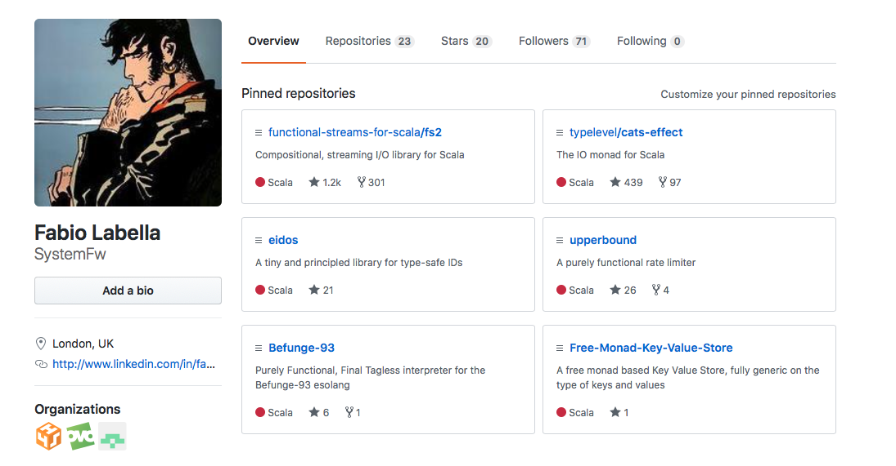

# Shared State in Pure FP
When a State Monad won't do <!-- .element: class="fragment" -->

Note:
- Explain what all these terms mean
- Why should you care
- How it's done
- Intermediate to proficient FP
- Bunch of cool stuff and techniques
- 34 slides

---

## About me



Note:
- Senior software engineer for OVO Energy in London
- Open source author, pure FP Scala: 
- fs2 maintainer, maintainer or contrib to http4s, cats-effect, cats, shapeless

---

## Purely Functional Programming


----

## Pure FP

**Referential transparency**:
> You can always replace an expression for its bound value, without changing the result

Note:
- x + x + 2, x = 1

----

## Pure FP

```scala
val x : String = "Hello".reverse
val y : String = x ++ x // "olleHolleH"
```

```scala 
val y : String = "Hello".reverse ++ "Hello".reverse 
// "olleHolleH"
``` 
<!-- .element: class="fragment" -->

<!-- .element: class="fragment" --> **Pure**

----

## Pure FP

```scala
val n : Int = StdIn.readInt

val result : Int = n + n
// > 2
// 4
```

```scala
val result : Int = StdIn.readInt + StdIn.readInt
// > 2
// > 3
// 5
```
<!-- .element: class="fragment" -->

<!-- .element: class="fragment" --> **Not pure**

----

## Pure FP

```scala
val read : Future[Int] = Future(StdIn.readInt)

val result : Future[Int] = (read, read).mapN(_ + _)
// > 2
// 4
```

```scala
val result : Future[Int] = 
    (Future(StdIn.readInt), Future(StdIn.readInt)).mapN(_ + _)
// > 2
// > 3
// 5
```
<!-- .element: class="fragment" -->

<!-- .element: class="fragment" --> **Not pure**

----

## Pure FP

```scala
val read : IO[Int] = IO(StdIn.readInt)

val result : IO[Int] = (read, read).mapN(_ + _)

// when you run it!
// > 2
// > 3
// 5
```

```scala
val result : IO[Int] = 
   (IO(StdIn.readInt), IO(StdIn.readInt)).mapN(_ + _)
   
// when you run it!
// > 2
// > 3
// 5
```
<!-- .element: class="fragment" -->

<!-- .element: class="fragment" --> **Pure!**

Note:
- You might get the impression that reading is the problem
- IO is purely functional
- read is a command/program, basically
- val result2: IO[Int] = read.map(x => x + x)

----

## Pure FP

-  <!-- .element: class="fragment" --> Side effects are things that break referential transparency
- <!-- .element: class="fragment" --> I/O, state and so on are _traditionally_ side effects, but don't have to be
-  <!-- .element: class="fragment" --> Referential transparency --> Local reasoning --> **Awesomeness**
- <!-- .element: class="fragment" --> Referential transparency is also known as _purity_


Note:
- composability, compositionality, inversion of control
- Topic for another talk, I've written about this at length
- At the end of the day all the benefits from referential transparency boil down to being able to understand and build code compositionally. That is, understanding code by understanding individual parts and putting them back together, and building code by building individual parts and combining them together. This is only possible if local reasoning is guaranteed, because otherwise there will be weird interactions when you put things back together, and referential transparency is defined as something that guarantees local reasoning.

---

## Shared State and Pure FP

Note:
- Referential transparency is awesome in general
- Purely functional shared state produces a very interesting property
- I want to both show why purely functional shared state is nice to work with *And* show you how it's done
- missing piece between knowing cats(-effect), and writing real-world code purely functionally

----

## State

- Local state is off topic for this talk <!-- .element: class="fragment" -->

```scala
def map[A, B](vec: Vector[A])(f: A => B): Vector[B] = {
  var i = 0
  val buf = collection.mutable.ArrayBuffer.empty[B]
  while(i < vec.length) {
    buf += f(vec(i))
    i += 1
  }
  buf.toVector
}

```
 <!-- .element: class="fragment" -->

From the outside, this function is referentially transparent
<!-- .element: class="fragment" -->


Note:
- state encapsulated in an actor or object
- external interface still not referentially transparent, here it is

----

## Shared State

-   <!-- .element: class="fragment" --> A brief look at the `State` datatype
-   <!-- .element: class="fragment" --> Limitations of `State`

Note:
- The State datatype, aka the state monad


----

## Cats.data.state

** `State[S, A]` **

-  <!-- .element: class="fragment" --> Describes modifications to an `S`, which result in an `A`
-  <!-- .element: class="fragment" --> `S` can be any _immutable_ datatype
-  <!-- .element: class="fragment" --> It's run by providing an initial value for `S`
-  <!-- .element: class="fragment" --> Many algebras (`Monad`, `Applicative`, and so on)

Note:
- I won't mention `StateT` or `IndexedState` in this talk, but the same thing applies, more or less

----

### State

```scala
case class State[S, A](modify: S => (A, S)) {
  def runA(initial: S): A = modify(initial)._1
  
  def flatMap[B](f: A => State[S, B]): State[S, B] =
    State { s =>
      val (result, nextState) = modify(s)
      f(result).modify(nextState)
    }
}
object State {
  def pure[S, A](a: A): State[S, A] = State { s => (a, s)}
  def get[S]: State[S, S] = State { s => (s, s)}
  def set[S](s: S): State[S, Unit] = State { _ => ((), s) }
}

```

Note:
- Composing state computations means assembling a modify function
- flatMap does state threading

----

### State example


```scala
sealed trait Command
case class Damage(n: Int) extends Command
case class Heal(n: Int) extends Command

def update[S](f: S => S): State[S, Unit] = for {
  v <- State.get[S]
  nv = f(v)
  _ <- State.set(nv)
} yield ()

def health(c: Command): State[Int, Unit] = c match {
    case Damage(n: Int) => update[Int](_ - n)
    case Heal(n: Int) => update[Int](_ + n)
  }

def report: State[Int, String] =
  State.get[Int].map { h => s"The current health is $h" }

val commands = List(Damage(1), Damage(5), Heal(2))

val res = commands.traverse { c =>
  health(c) >> report
}.runA(10)

//  res0: List[String] = List(The current health is 9, The current health is 4, The current health is 6)
```

- <!-- .element: class="fragment" --> Pure
- <!-- .element: class="fragment" --> Compositional
- <!-- .element: class="fragment" --> Testable

----

## Issues

- <!-- .element: class="fragment" --> Threading an `S` via `S=>(A,S)` is _inherently sequential_
- <!-- .element: class="fragment" --> Most state is _concurrent_
- <!-- .element: class="fragment" --> Some of it is already mutable
- <!-- .element: class="fragment" --> `State` won't do, can we still keep referential transparency?

Note:
- Concurrent: request counter, cache, queue, rate limiter, FSM
- Mutable: JDBC connection
- What should we do? Can we keep purity and still have concurrent state?

---

## cats-effect 

**`IO[A]`** <!-- .element: class="fragment" -->

- <!-- .element: class="fragment" --> Produces one value, fails or never terminates
- <!-- .element: class="fragment" --> *Referentially transparent* (pure)
- <!-- .element: class="fragment" --> Can suspend any side-effect
- <!-- .element: class="fragment" --> Many algebras (`Monad`, `Sync`, `Concurrent`...)

----

## Idea

**Concurrent shared state happens in `IO`**

<!-- .element: class="fragment" -->...or any `F[_]` with a suitable typeclass (at least `Sync`)

----

## Design

- <!-- .element: class="fragment" --> Either wrap mutable data directly
- <!-- .element: class="fragment" --> Or use `cats-effect` primitives with immutable data
- <!-- .element: class="fragment" --> Use the primitives when you can (most of the time), direct wrapping when you must

Note:
- Primitives allow you to add concurrency and mutability to an immutable type in a modular fashion
- We'll see both approaches by first implementing the primitive with wrapping, and then using it

----

## Wrapping

** Access, modification and _creation_ of mutable state needs suspension in `IO` **

Note:
- If creation is not suspended we get them unwanted sharing/memoisation that Future has, which breaks
referential transparency

----

## Ref[F, A]

- <!-- .element: class="fragment" --> Purely functional, concurrent, lock-free mutable reference

```scala
trait Ref[F[_], A] {
  def get: F[A]
  def set(a: A): F[Unit]
  def update(f: A => A): F[Unit]
  def modify[B](f: A => (A, B)): F[(A, B)]
}
object Ref  {
  def create[F[_]: Sync, A](v: A): F[Ref[F, A]]
}
```
<!-- .element: class="fragment" -->

Note:
- update and modify are concurrency safe
- A is immutable, Ref adds mutation on it
- creation is in `F``

----

## IORef

```scala
final class IORef[A] private (ar: AtomicReference[A]) {
  def get: IO[A] = IO(ar.get)
  def set(a: A): IO[Unit] = IO(ar.set(a))
  def update(f: A => A) = IO {
    def loop: Unit = {
      val oldState = ar.get
      val newState = f(oldState)
      if (ar.compareAndSet(oldState, newState)) () else loop
    }
    loop
  }
}
object IORef {
  def create[A](a: A): IO[IORef[A]] = IO(new IORef(new AtomicReference(a)))
}
```
<!-- .element: class="fragment" -->

Note:
- slightly simplified, hardcoded IO, no `modify`
- Simple recipe: suspend every op including creation
- if it was a JDBC connection, you'd do the same

----

## Ref[F, A]
```scala
trait Ref[F[_], A] {
  def get: F[A]
  def set(a: A): F[Unit]
  def update(f: A => A): F[Unit]
  def modify[B](f: A => (A, B)): F[(A, B)]
}
object Ref  {
  def create[F[_], A](v: A)(implicit F: Sync[F]): F[Ref[F, A]] =
    F.delay(new AtomicReference(v)).map { ar =>
      new Ref[F, A] {
        def get: F[A] = F.delay(ar.get)
        def set(a: A): F[Unit] = F.delay(ar.set(a))
        def update(f: A => A): F[Unit] = F.delay { ... }
        def modify[B](f: A => (A, B)): F[(A, B)] = F.delay { ... }
      }
    }
}
```

Note:
- The same, but abstract over `F` and uses `F.delay`
- short slide, keep it quick

---

## Using purely functional state

----

## Trivia

```scala
val counter: IO[Ref[IO, Int]] = Ref.create[IO, Int](0)

val prog: IO[Int] = for {
  _ <- counter.flatMap(_.update(_ + 1))
  v <- counter.flatMap(_.get)
} yield v

def res = prog.unsafeRunSync

```
<!-- .element: class="fragment" -->


```scala
val prog: IO[Int] = for {
  _ <- Ref.create[IO, Int](0).flatMap(_.update(_ + 1))
  v <- Ref.create[IO, Int](0).flatMap(_.get)
} yield v

def res = prog.unsafeRunSync

```
<!-- .element: class="fragment" -->

Note:
- Memoisation red herring; it's just side-effects

----

## Solution

```scala
val counter: IO[Ref[IO, Int]] = Ref.create[IO, Int](0)

def prog(c: Ref[IO, Int]): IO[Int] = for {
  _ <- c.update(_ + 1)
  v <- c.get
} yield v

def main = counter.flatMap(c => prog(c))

def res = main.unsafeRunSync
```
<!-- .element: class="fragment" -->

```scala
Ref.create[IO, Int](0).flatMap { c =>
  for {
    _ <- c.update(_ + 1)
    v <- c.get
  } yield v
}
```
<!-- .element: class="fragment" -->

----

## State sharing (and isolation)

```scala
def cache: IO[Cache[IO, User]] = Cache.create[IO, User]
def p1(c: Cache[IO, User]): F[Unit] = ???
def p2(c: Cache[IO, User]): F[Unit] = ???

def separateCaches = 
 cache.flatMap(p1) >> cache.flatMap(p2)

def sameCache = cache.flatMap { c =>
    p1(c) >> p2(c)
}
```
<!-- .element: class="fragment" -->

- Create a region of sharing by passing arguments <!-- .element: class="fragment" -->
- "Seal it"" when you flatMap the resource <!-- .element: class="fragment" -->
- Higher in the call graph: more sharing <!-- .element: class="fragment" -->

Note:
- You might think the first example is broken, the second works
- Both useful: how to share and who to isolate
- The highest point in the call graph is main: global resource
- segway intot the key slide

----

## Key property

** `The regions of state sharing are the same as the call graph` **

- From dynamic behaviour to syntactical property <!-- .element: class="fragment" -->
- Always understandable by substitution <!-- .element: class="fragment" -->
- No spaghetti through controlled sharing and isolation <!-- .element: class="fragment" -->
- Testable by default because state is injected <!-- .element: class="fragment" -->

---

## Final tagless

Note:
- Representing an algebra by its eliminators
- Practically, a parameterised trait with functions

----

## Ref itself!

```scala
trait Ref[F[_], A] {
  def get: F[A]
  def set(a: A): F[Unit]
  def update(f: A => A): F[Unit]
  def modify[B](f: A => (A, B)): F[(A, B)]
}
object Ref  {
  def create[F[_]: Sync, A](v: A): F[Ref[F, A]]
}
```

----

## Build abstraction

```
trait Counter[F[_]] {
  def increment: F[Unit]
  def get: F[Long]
  def reset: F[Unit]
}
object Counter {
  def create[F[_]: Sync]: F[Counter[F]] =
    Ref.create[F, Long](0).map { c =>
      new Counter[F] {
        def increment: F[Unit] = c.update(_ + 1)
        def get: F[Long] = c.get
        def reset: F[Unit] = c.set(0)
      }
    }
}
```
<!-- .element: class="fragment" -->

```scala
def tick[F[_]](implicit timer: Timer[F], counter: Counter[F]): F[Unit] =
 timer.sleep(1.second) >> counter.increment >> tick[F]
```
<!-- .element: class="fragment" -->


Note:
- Explicit F.delay suspension no longer visible
- Alternative implementation for testing
- Can encapsulate very complex logic
- tick itself can be abstracted, fibers spawning, stream returning

----

## Examples

- **cats-effect**: `Ref`, `Deferred`, `Semaphore`, `MVar`
- **fs2**: `Queue`, `Signal`, `Topic`
- **http4s**: `Client`
- **fs2-reactive-streams**: `Subscriber.FSM`
- **upperbound**: `Limiter`
- **doobie**: `Transactor`
- Your own business logic abstraction!

Note:
- Client shares the connection pool
- Just from the stuff I work on

----

## More than `F`

- <!-- .element: class="fragment" --> `Resource[F, A]`: 
  resource safety
- <!-- .element: class="fragment" --> `Stream[F, A]`: 
  resource safety, streaming, concurrency, control flow 

<!-- .element: class="fragment" -->...check my other talks on `Stream`

Note:
- still based on `F`

---

## Recap

- <!-- .element: class="fragment" --> Referential transparency rules
- <!-- .element: class="fragment" --> Concurrent state is in `IO`
- <!-- .element: class="fragment" --> Sharing regions = call graph
- <!-- .element: class="fragment" --> Build abstraction with tagless final

---

## Conclusion

> Concurrent shared state (and effects in general) are not a weakness of pure FP, they're a strength

<!-- .element: class="fragment" -->

---

# Questions?

- I'm not on Twitter, reach out on Gitter @SystemFw!

